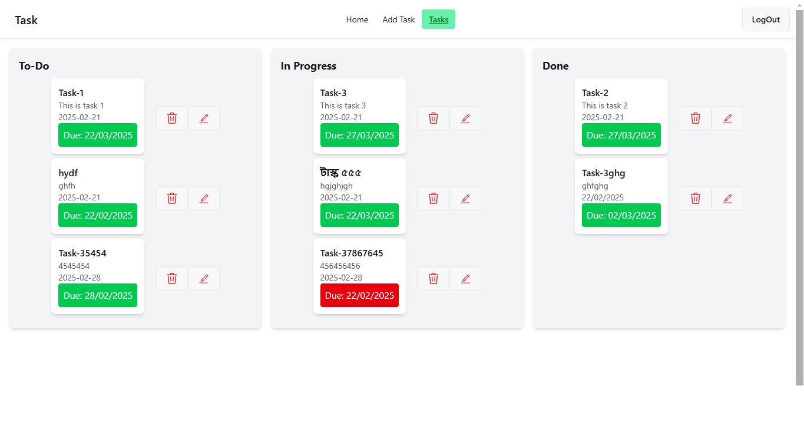

# Project Name is : Task Management

A simple and interactive task management application built with MERN Stack. Users can add, update, delete, and reorder tasks using drag & drop. Features include: Private Routes for authentication 🔒 Due Date Indicators (Overdue in red, upcoming in yellow, on-time in green) 📅 Activity Log to track task movements 📜 Real-time Updates with React Que

## 2 Key Features :

- **Toggle Theme Change Button**:When a user wants to change the theme on this website, they can press the theme button. The website will then switch between dark and light modes.

- **Dynamic Routing**: A logged in user will be able to visit home ,add Task , update task, Task page  etc page without reloading the page.

- **Private Route**:If a user not logged in, he can not visit the site.

- **Toastify Alert / Sweet Alert**: Whenever a user performs an action, such as login or sign in or logout , delete, edit, a Toastify alert / sweet alert pops up at the top of the screen / middle of the screen. Each alert can display custom messages, such as "Successfully logged in" or "Error: create user is not successfully or Equipments added successfully ETC."

- **Use a drag-and-drop library**: Using   drag-and-drop library to drag any category to other category.

## 🛠️ **Technology Stack**  

| **Category**         | **Technologies Used**                      |
|----------------------|-------------------------------------------|
| **Frontend**         | React, Vite, Tailwind CSS, DaisyUI        |
| **State Management** | React Query , Context API                              |                         
| **Routing**          | React Router DOM                          |
| **Backend**          | Firebase (Authentication)                 |                             
| **Notifications**    | React Hot Toast, SweetAlert2              |
| **Search & Sort**    | Match Sorter, Sort-By                     |
| **Deployment**       | *(Vercel, Netlify,Firebase etc.)*                 |  

## **Dependencies**  

   - "@dnd-kit/sortable": "^10.0.0",
   - "@tailwindcss/vite": "^4.0.7",
   - "@tanstack/react-query": "^5.66.7",
   - "axios": "^1.7.9",
   - "firebase": "^11.3.1",
   - "localforage": "^1.10.0",
   - "lottie-react": "^2.4.1",
   - "match-sorter": "^8.0.0",
   - "react": "^19.0.0",
   - "react-dom": "^19.0.0",
   - "react-hook-form": "^7.54.2",
   - "react-hot-toast": "^2.5.2",
   - "react-icons": "^5.5.0",
   - "react-router-dom": "^7.2.0",
   - "sort-by": "^1.2.0",
   - "sweetalert2": "^11.17.2",
   - "tailwindcss": "^4.0.7"
  
## Dev Dependencies

   - "@eslint/js": "^9.19.0",
   - "@types/react": "^19.0.8",
   - "@types/react-dom": "^19.0.3",
   - "@vitejs/plugin-react": "^4.3.4",
   - "daisyui": "^5.0.0-beta.8",
   - "eslint": "^9.19.0",
   - "eslint-plugin-react": "^7.37.4",
   - "eslint-plugin-react-hooks": "^5.0.0",
   - "eslint-plugin-react-refresh": "^0.4.18",
   - "globals": "^15.14.0",
   - "vite": "^6.1.0"
 

## 1.Installation

Run `npm install` to install project dependencies.

## Usage

Run `npm run dev` to run the project locally.

## GITHUB REPOSITORY LINK (CLIENT SIDE) : https://github.com/Md-SayeedAlam/Task_Management_Client_Repo

## GITHUB REPOSITORY LINK (SERVER SIDE) : https://github.com/Md-SayeedAlam/Task-Management-Server-Repo

## LIVE LINK : FIREBASE : https://task-management-applicat-6d68e.web.app/

## LIVE lINK: NETLIFY:  https://sayeed-task-management.netlify.app/

